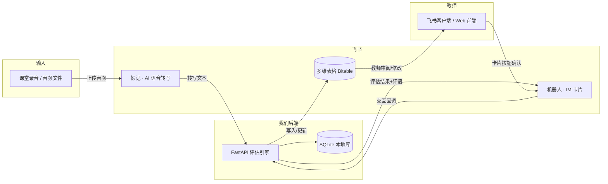

# 飞书集成技术方案（草稿 v0.1）

> 状态：规划中 · 待团队评审
> 关联：2026 AI先锋未来人才大赛 · 飞书命题

## 1. 背景与目标

### 1.1 为什么要接飞书

- **大赛硬性要求**：参赛作品应至少使用一项飞书 AI 产品能力。
- **评分维度"AI 应用深度"**：飞书能力需要长在产品工作流里，而不是最后外挂一个"机器人发消息"。
- **业务契合**：思辨课以口头表达为主，学生发言转写是教师最痛的环节；评语审阅与发放天然发生在聊天和表格场景。

### 1.2 集成目标

**核心目标（MVP）**：课堂音频 → 飞书妙记自动转写 → 进入现有双层评估流水线 → 评估结果沉淀到飞书多维表格 → 机器人推送评语卡片，教师一键确认。

**扩展目标**：教师在多维表格内完成审阅决策；@机器人 按指令生成/推送评语；多维表格 AI 字段捷径辅助打标签。

### 1.3 设计原则

1. 现有 FastAPI + SQLite + LLM 流水线保持为主干，飞书作为**输入层 / 展示层 / 交互层**接入。
2. **本地库是唯一事实源**，多维表格是同步展示与审阅面（MVP 阶段单向同步，避免双向一致性复杂度）。
3. 每个飞书能力可独立失败回退：妙记不可用时回退到手动录入文本，机器人不可用时评语仍在 Web 页面生成。

## 2. 总体架构



**叙事主线**：课堂语音从飞书进来（妙记），评估结果从飞书出去（多维表格 + 机器人），教师在整个链路里做决定。

## 3. 飞书能力选型

| 能力 | 在系统中的角色 | 是否 AI 产品能力 | 价值点 |
|------|--------------|-----------------|--------|
| 妙记（语音转写） | 输入层 | ✅ 是（ASR） | 课堂口头发言自动转写，直接对接双层流水线 Layer 1 |
| 多维表格（+ AI 字段捷径） | 数据层 | 可选（AI 字段捷径是 AI 能力） | 评估数据沉淀、教师审阅面、AI 自动打标签 |
| 机器人（IM 消息/卡片） | 交互层 | 否（基础能力） | 评语推送、待审清单、一键确认 |
| aily 智能伙伴 / 智能体 | 扩展（可选） | ✅ 是 | 对话式评估助手，后期可加 |

**结论**：以"妙记 + 多维表格"作为作品中明确使用的飞书 AI 产品能力（妙记语音转写是纯 AI 能力，与双层流水线叙事无缝衔接），机器人作为交互载体。多维表格 AI 字段捷径可作为演示中的补充亮点。

## 4. 模块详细设计

### 4.0 鉴权与客户端（前置基建）

- 使用**大赛专属租户**开通的自建应用（企业自建应用），获取 App ID / App Secret。
- 统一封装 `backend/feishu/client.py`：
  - `tenant_access_token`：`POST https://open.feishu.cn/open-apis/auth/v3/tenant_access_token/internal`，请求体 `{"app_id": ..., "app_secret": ...}`；有效期约 2 小时，内存缓存 + 到期前 5 分钟自动刷新。
  - MVP 阶段尽量只操作**应用身份可访问的资源**（应用所在租户的共享文件夹、机器人的可见范围），避免 `user_access_token` 的 OAuth 流程；确需用户资源时再引入授权码模式。
- 技术选型：官方 Python SDK `lark-oapi`（自带 token 管理、事件签名校验、卡片回调处理）；若 SDK 与当前 Python 3.14 兼容性有问题，回退为手写 httpx（仓库已有该依赖）。

### 4.1 模块 A：妙记转写（语音评估输入）

**目标**：教师上传课堂音频 → 自动转写 → 写入 `student_responses.raw_text` → 走现有评估流水线。

**数据流**：

1. 前端（或机器人指令）上传音频 → `POST /api/feishu/minutes/import`，参数 `{course_id, student_id, topic_id, file}`。
2. 后端两步上传：
   - `POST /open-apis/drive/v1/medias/upload_all` 上传媒体文件，得到 `file_token`；
   - 用 `file_token` 创建妙记（具体端点待验证，见 §7 待验证清单）。
3. 轮询妙记转写状态（若支持转写完成事件则改为事件订阅触发，待验证）。
4. 转写就绪后调用 **导出妙记文字记录**：`GET /open-apis/minutes/v1/minutes/{minute_id}/transcript`，获取转写文本。
5. 转写文本写入 `StudentResponse.raw_text`，`source="asr"`，记录 `feishu_minute_id`。
6. 触发现有 `evaluator.assess()`（Layer 1 清洗 + Layer 2 评估），与手动文本流程完全一致。

**约束**：

- 妙记语音转文字额度：**每个自然月每个用户累计 300 分钟**（含会议录制、录音、本地文件上传、云文件导入四种场景），超出的新妙记不再生成文字记录。演示前要核对当月用量。
- 支持格式 / 单文件时长上限：实施时验证（常见 mp3 / wav / m4a，建议单文件控制在 1 小时内）。
- 转写文本会保留口语填充词（"嗯""那个"）——这正好是 Layer 1 清洗的输入，叙事上自洽。

**API 变更**：新增 `POST /api/feishu/minutes/import`、`GET /api/feishu/minutes/{id}/status`；`StudentResponse` 增加 `feishu_minute_id`、`source` 字段。

### 4.2 模块 B：多维表格（数据沉淀 + 教师审阅面）

**目标**：评估数据同步到多维表格，教师能在表格里看到原始文本、清洗文本、AI 评分、教师评分、标签与状态。

**表结构建议（4 张表，与现有数据模型一一对应）**：

1. `courses` 班级表：班级名、年级、创建时间
2. `topics` 辩题表：标题、类型（单选）、认知梯段（单选）、引导材料、参考论据、顺序
3. `students` 学生表：姓名、年级（数字）、认知梯段（单选）、班级、评语草稿
4. `responses` 评估记录表：学生、辩题、来源（单选：手动/妙记）、原始文本、清洗文本、AI 评分摘要（文本）、各维度 AI 评分（每维度一列，单选 A+/A/A-/B+/B/B-）、AI 置信度（单选）、AI 建议标签（多选）、教师评分（文本）、教师标签（多选）、教师批注、状态（单选：待评估/AI 已评/教师已审）、更新时间

**同步策略（MVP：单向同步，本地库为主）**：

- 评估完成 / 教师保存后，后端调用批量接口写回多维表格。
- 教师在多维表格内的改动暂不回写本地库（避免双向同步一致性复杂度）；如需回写，通过事件订阅或"从表格导入"按钮手动触发，列为后续迭代。

**关键 API**：

- 列出数据表：`GET /open-apis/bitable/v1/apps/{app_token}/tables`
- 查询记录：`POST /open-apis/bitable/v1/apps/{app_token}/tables/{table_id}/records/search`（单次 ≤500 行，支持 filter 与分页）
- 新增多条记录：`POST .../records/batch_create`（单次 ≤1000 条）
- 更新多条记录：`POST .../records/batch_update`（按 `record_id` 幂等匹配）
- 字段写入格式：文本=1、数字=2、单选=3（选项需已存在）、多选=4、日期=5（毫秒时间戳）、人员=11（open_id）

**待验证**：`app_token` 的获取（wiki 链接需先调用知识空间节点接口解析）；单选字段选项能否通过 API 自动创建。

### 4.3 模块 C：机器人（评语推送与交互）

**目标**：评估完成后机器人推送"待审清单"和"评语卡片"；教师点卡片按钮确认 / 修改，回调落库并生成校准记录。

**数据流**：

1. 批量评估完成 → `POST /open-apis/im/v1/messages?receive_id_type=open_id` 向教师发送评语卡片（`msg_type=interactive`，`content` 为卡片 JSON 字符串）。
2. 卡片含"确认评分 / 修改 / 发送给学生"按钮 → 飞书交互卡片回调 `POST` 到后端 `/api/feishu/card`。
3. 后端校验回调签名 → 更新 `teacher_reviewed`、教师评分 → 复用现有逻辑写校准记录。
4. 进阶：教师 @机器人 发送"给小雨生成评语" → 事件订阅 `im.message.receive_v1` → 机器人调用现有 `generate_comment` 逻辑回复。

**关键 API**：

- 发送消息：`POST /open-apis/im/v1/messages?receive_id_type=open_id`（支持 text / post / interactive）
- 回复消息：`POST /open-apis/im/v1/messages/{message_id}/reply`
- 事件订阅：配置回调 URL，需支持 `challenge` 验证与事件签名校验（Verification Token / Encrypt Key）
- 限频：消息发送整体 1000 次/分、50 次/秒；同一用户 5 QPS——批量推送需分批

**注意**：必须是**应用机器人**（开发者后台开启机器人能力），群自定义机器人无法调用 `im/v1/messages`。

### 4.4 后端代码落地

```
backend/feishu/
├── __init__.py
├── client.py        # token 缓存、HTTP 封装、错误处理、限频退避
├── minutes.py       # 音频上传、妙记创建、转写轮询、文本获取
├── bitable.py       # 表结构定义、记录批量读写、字段类型映射
├── bot.py           # 消息/卡片发送、事件与卡片回调处理
└── routes.py        # /api/feishu/* 路由挂载
```

**`.env` 新增配置**：

```dotenv
FEISHU_APP_ID=cli_xxx
FEISHU_APP_SECRET=xxx
FEISHU_BITABLE_APP_TOKEN=xxx
FEISHU_BITABLE_TABLE_IDS={"courses":"...","topics":"...","students":"...","responses":"..."}
FEISHU_VERIFICATION_TOKEN=xxx
FEISHU_ENCRYPT_KEY=xxx
FEISHU_TEACHER_OPEN_ID=ou_xxx
```

**依赖**：`lark-oapi`（官方 Python SDK）。

## 5. 权限与开通清单（开放平台后台）

| 能力 | 权限（名称以最新后台为准，待验证） |
|------|----------------------------------|
| 机器人发消息 | 获取与发送单聊、群组消息（im:message）；以应用身份发送消息（im:message:send_as_bot） |
| 妙记 | 读取妙记；**导出妙记转写的文字内容**（"导出妙记文件"权限已不对新应用开放） |
| 多维表格 | 查看、编辑多维表格（bitable 相关文档权限） |
| 云盘媒体 | 上传、读取文件（drive:drive 相关权限） |
| 事件订阅 | im.message.receive_v1 等 |

## 6. 实施路线（里程碑）

| 里程碑 | 周期 | 负责人 | 交付物 |
|--------|------|--------|--------|
| M0 前置 | 半天 | 队长 | 确认大赛租户已开通、创建自建应用、拿到 App ID/Secret、向企业教练确认妙记权限与配额 |
| M1 基建 | 1 天 | 后端 | `feishu/client.py` + token 缓存 + health check 路由 + `.env` 配置 |
| M2 妙记闭环 | 2-3 天 | 后端（队长提供演示音频） | 上传示例音频 → 转写 → 评估 → 前端显示"妙记来源"标记 |
| M3 多维表格 | 2 天 | 后端 + 前端 | 建 4 张表、批量写入、前端新增"飞书同步"状态 |
| M4 机器人 | 2 天 | 后端 | 评语卡片推送、卡片按钮确认回调、事件订阅（或轮询兜底） |
| M5 演示打磨 | 2 天 | 全员 | 端到端 demo 脚本、示例音频、README/开题报告更新、部署 |

**风险与兜底**：

- 妙记 API 权限 / 额度不满足 → 兜底方案：录音文件手动上传 + 后端调用转写服务（削弱"飞书 AI 能力"叙事，尽量避免，先找教练确认）。
- 公网回调困难 → 机器人交互先用"主动推送 + 轮询查询"实现，事件订阅列为可选。
- 多维表格字段类型兼容问题 → 维度评分以文本摘要列兜底展示，不阻塞 MVP。

## 7. 待验证清单（写代码前确认）

- [ ] 妙记创建 / 上传的准确端点与请求参数（drive `upload_all` → minutes 创建）
- [ ] 妙记转写完成是可订阅事件，还是需要轮询
- [ ] 妙记支持的文件格式、大小、时长上限
- [ ] "导出妙记转写的文字内容"权限的准确名称与申请路径
- [ ] 多维表格单选字段选项是否可自动创建
- [ ] 大赛专属租户对开放平台 API 的可用范围（是否与企业版一致）
- [ ] 机器人卡片按钮回调（card action）的签名校验方式
- [ ] `lark-oapi` SDK 与仓库 Python 3.14 环境的兼容性

## 8. 演示叙事建议（供队长写脚本）

90 秒主线：

1. 课堂录音上传 → 妙记 AI 转写（展示"嗯""那个"等口语噪声）；
2. 双层流水线：清洗后文本 vs 原始文本对比展示；
3. 多维表格展示评估结果：各维度评分 + 推理链 + AI 建议标签；
4. 教师在页面/表格里修改 1 个评分 → 系统记录校准差异；
5. 机器人推送评语卡片 → 教师一键确认 → 发送给学生。

一句话总结（备选 slogan）：

> 课堂语音从飞书进来，评估结果从飞书出去——AI 做转写与分析，教师做决定。

## 9. 与现有代码的改动清单

| 文件 | 改动 |
|------|------|
| `backend/requirements.txt` | 新增 `lark-oapi` |
| `backend/main.py` | 挂载 `feishu/routes.py` |
| `backend/database.py` | `StudentResponse` 增加 `feishu_minute_id`、`source`；新增 `FeishuBinding` 表（本地实体 ↔ 飞书记录映射） |
| `backend/schemas.py` | 新增音频导入、转写状态、同步状态相关模型 |
| `frontend/src/pages/GradingPage.jsx` | 作答来源标记（手动/妙记）；"同步到飞书"状态 |
| `frontend/src/pages/CommentsPage.jsx` | "发送给学生"按钮接通机器人推送 |
| `README.md` / `开题报告.md` | 补充飞书集成章节 |
